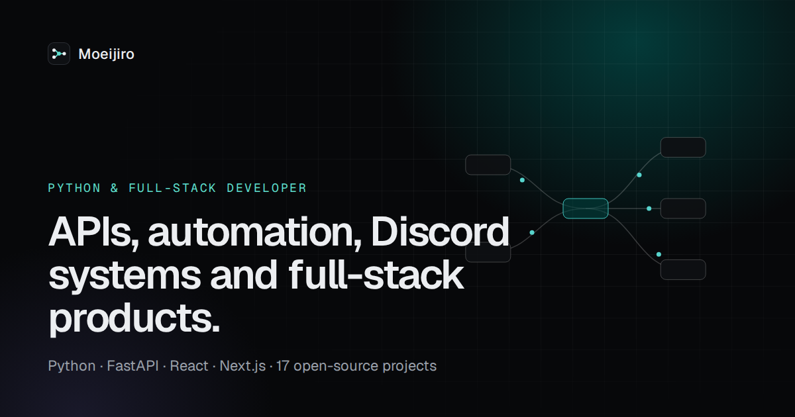

# Portfolio

The source of **[moeijiro.github.io/portfolio](https://moeijiro.github.io/portfolio/)** — the portfolio of a Python
backend and automation developer: Discord systems, APIs and full-stack web applications.



It presents 16 open-source projects. The eight flagship projects each get a case study: problem, solution, an
architecture diagram, core features, technical decisions, a real code excerpt, screenshots and how to run them.

## How it's built

| Layer | Choice |
| --- | --- |
| Framework | Next.js 16 (App Router), static export (`output: "export"`) |
| UI | React 19, TypeScript, Tailwind CSS v4, Motion |
| Code excerpts | Shiki, highlighted at build time — no highlighter shipped to the browser |
| Hosting | GitHub Pages, deployed by GitHub Actions on every push to `main` |

- **Architecture diagrams are data.** Each project's diagram is a list of columns and edges in
  `src/content/projects.ts`; `src/components/diagram.tsx` lays it out horizontally on wide screens and vertically on
  phones, and animates packets along the edges (switched off under `prefers-reduced-motion`).
- **Nothing is invented.** Project text comes from each repository's README and code. Code excerpts are copied from the
  repositories by `scripts/excerpts.mjs` and link to the exact lines at a pinned commit. Test counts are collected with
  `pytest --collect-only`. Screenshots are the repositories' own `docs/screenshots`, converted to WebP by
  `scripts/images.mjs`.
- **Social images** (`public/og/*.png`, 1200×630) and the LinkedIn banner (1584×396) are rendered by
  `scripts/og.mjs` with headless Chrome from the same screenshots.

```
src/
  app/                 routes: /, /projects, /projects/[slug], /services, /about, /contact, sitemap, robots
  components/          diagram, project cards and filter, code excerpt, header/footer
  content/             projects.ts (all project data), home.ts, excerpts.json (generated)
scripts/               excerpts.mjs · images.mjs · og.mjs
public/shots/          WebP screenshots per repository
public/og/             social images
```

## Running locally

```bash
npm ci
npm run dev            # http://localhost:3000/portfolio
npm run build          # static site in out/
```

`BASE_PATH` controls the sub-path (default `/portfolio`); set `BASE_PATH=""` to serve from a domain root.

Regenerating content from local clones of the project repositories:

```bash
SRC=../ node scripts/excerpts.mjs
SRC=../ node scripts/images.mjs
node scripts/og.mjs
```

## Checks

- `npm run lint` and `npm run build` run in CI before every deploy.
- Every page is checked at 390 px for horizontal overflow; interactive elements are keyboard reachable, the diagram
  has a text alternative, and motion respects `prefers-reduced-motion`.

## License

Code: MIT. Project screenshots and text describe the author's own open-source repositories.
